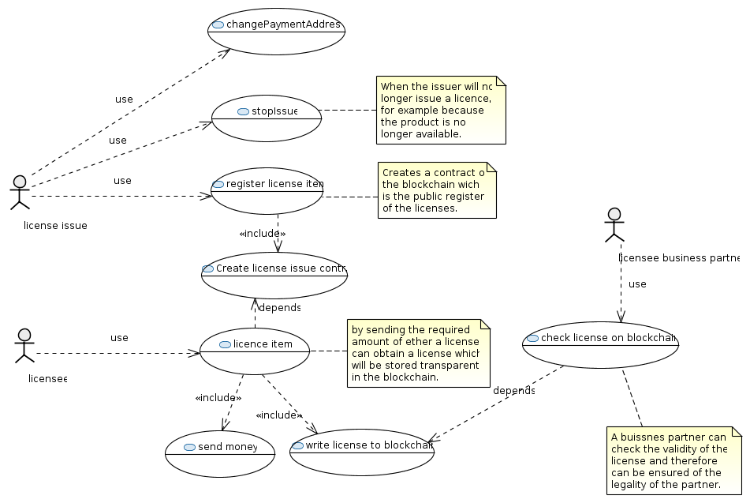
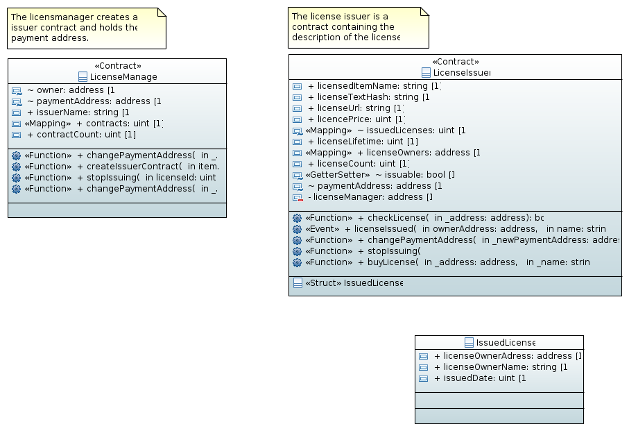

# licensemanager

Some smart contracts for the etherum blockchain to manage a licensable item. 
The license are stored transparent on the blockchain and can be reviewed.

The uml model is used to generate the solidity code with the [uml2solidity](https://github.com/UrsZeidler/uml2solidity) plugin for eclipse.

There are two contracts, the LicenseManager creates the issuer contracts and is able to control them, while the LicenseIssuer 
contracts are responsible to issue and hold the assigned licenses. 

There is a [generated model doc](licensemanager/doc/contracts.md) describing the underlying model.

you can `tip the coder` by sending some ether : 0x25b2ce55746f54d88e9fc4d2f0f85e879c30bb05